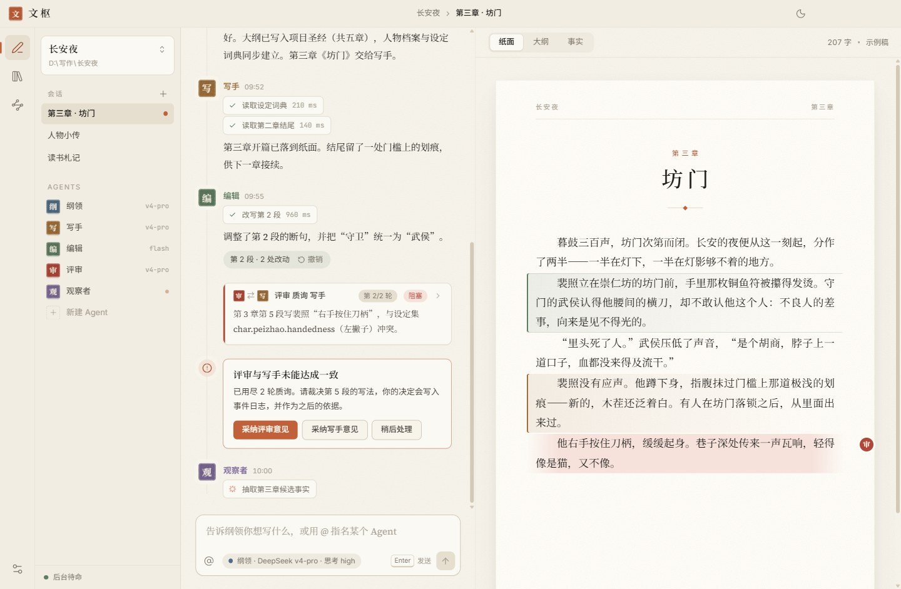
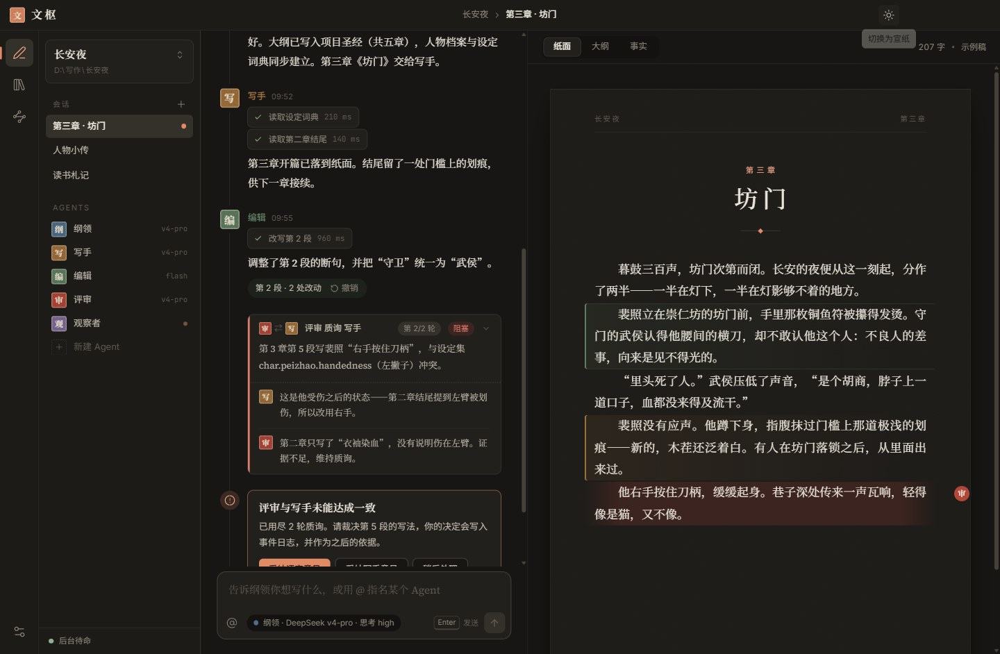
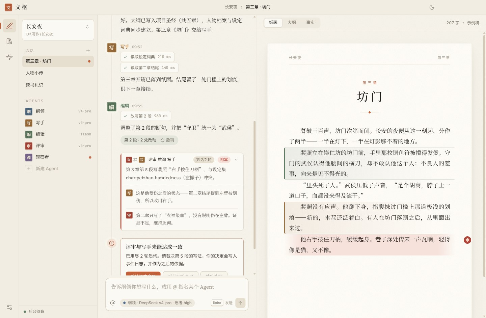
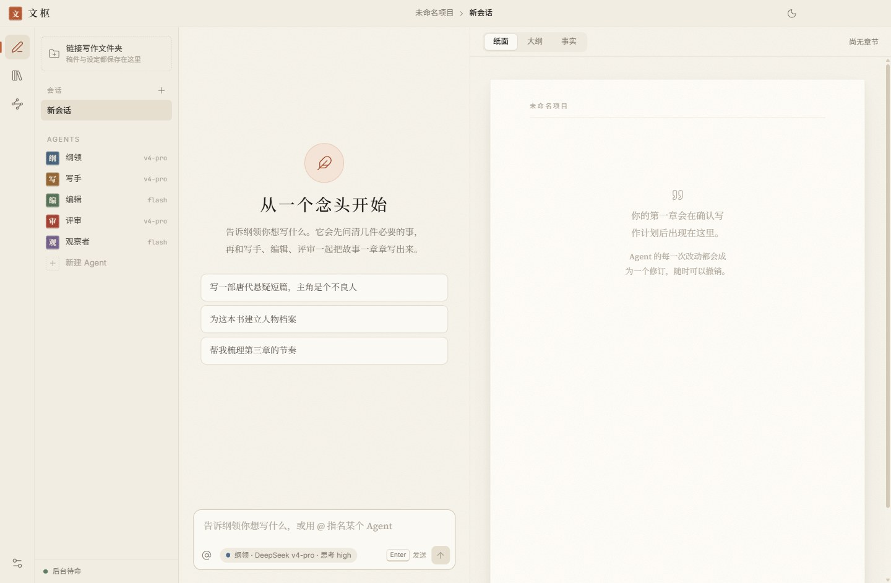
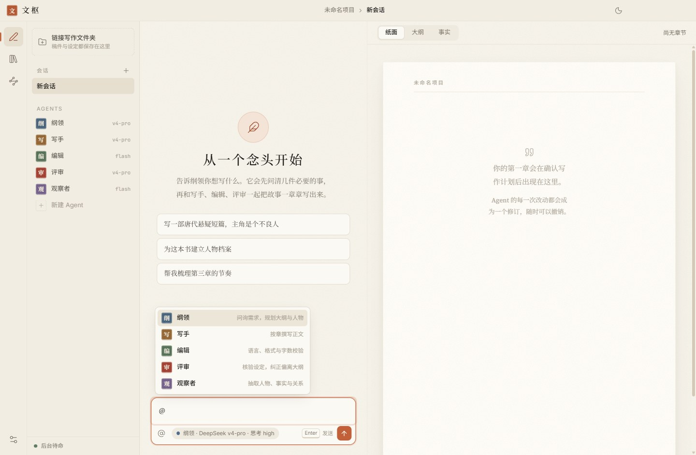
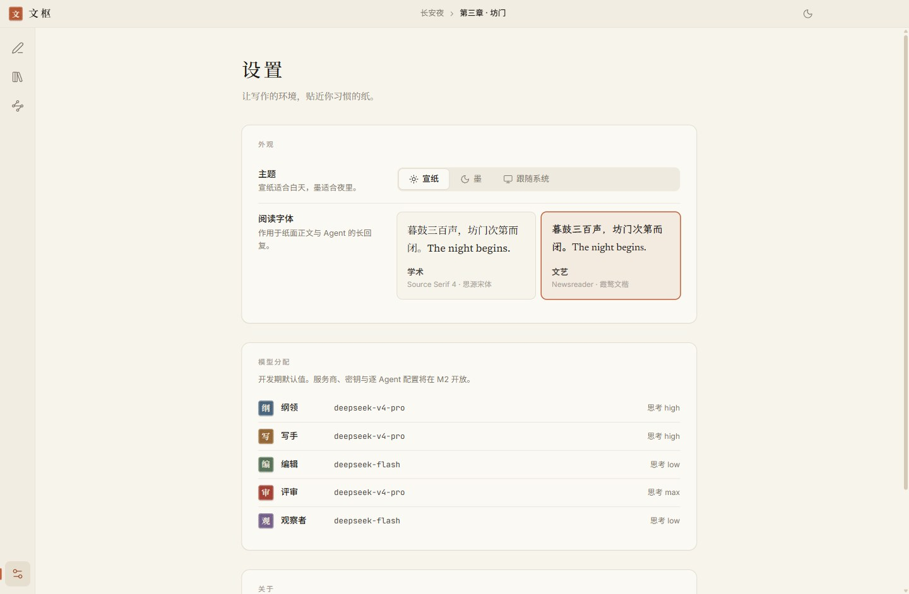

# 文枢桌面壳设计说明

目标：简洁、优雅、文艺，让人感觉“在洁净的环境、有质感的纸张上创作”。设计依据见 [research/ui-ux-design.md](../research/ui-ux-design.md)。

| 宣纸 | 墨 |
|---|---|
|  |  |

质询线程展开 · 首次启动 · @ 选择 · 设置页：

> 截图由 `npm run build:desktop && node scripts/design-shots.mjs` 用真实 Electron 渲染生成（演示数据，`WORDHUB_DEMO=1`）。

## 设计语言

- **两层纸**：画布是带纸纹的底，文档是更亮的一页“纸”；层级主要靠色块区分，阴影只用于纸面和浮层。
- **色彩**：宣纸 `#F7F4EC`、纸面 `#FFFDF8`、墨 `#171614`；强调色是朱砂陶土 `#C2603A`（暗色 `#E08A66`）。全部通过 [tokens.css](../../apps/desktop/src/renderer/styles/tokens.css) 的变量引用，组件里不写色值。
- **Agent 身份色**取自矿物颜料：黛蓝（纲领）、赭石（写手）、松绿（编辑）、朱砂（评审）、藤紫（观察者）；头像是篆刻印章式的单字。
- **字体**（全部随应用打包，OFL 许可，无需联网）：

| 用途 | 英文 | 中文 |
|---|---|---|
| 界面 | Inter | 思源黑体 |
| 学术阅读 | Source Serif 4 | 思源宋体 |
| 文艺阅读 | Newsreader | 霞鹜文楷 Screen |
| 标题 | Fraunces | 思源宋体 |
| 等宽 | JetBrains Mono | — |

- **中文标点矫正**：拉丁衬线自带的弯引号、破折号、省略号是窄字形，和中文并排很突兀。[punct.css](../../apps/desktop/src/renderer/styles/punct.css) 用 `unicode-range` 把这几个码位单独指向思源宋体 / 霞鹜文楷的全角字形，其余字符不受影响。升级字体包后需复核其中的分片编号。
- **排版**：纸面正文 17px、行高 1.85、两端对齐、首行缩进两字；对话区消息宽度上限 680px。
- **动效**：只做透明度与不超过 8px 的位移；进入慢、退出快；统一用 token 里的缓动；尊重系统“减少动态效果”。

## 已实现

自绘标题栏（窗口控制按钮随主题变色）、导航轨与可拖拽三栏、会话栏与 Agent 列表、群聊（印章头像、时间线、工具调用折叠卡、质询线程、审批卡、流式墨点光标、@ 选择器与键盘操作）、纸面（纸纹、章节排版、作者色条、评审边注）、设置页（主题、阅读字体、模型分配展示）、亮 / 暗 / 跟随系统主题。

## 尚未实现

| 项 | 计划 |
|---|---|
| Windows 11 Mica 材质 | M5，需在真机上验证效果 |
| 命令面板（Ctrl+K） | M5 |
| 纸面编辑（ProseMirror） | M5 |
| 分栏宽度记忆 | M1 界面接线时一并做 |
| 真实数据接线（会话、消息、章节） | M1，见 [m1-plan.md](../m1-plan.md) |

## 预览数据

`?demo=1`（或环境变量 `WORDHUB_DEMO=1`）载入[演示数据](../../apps/desktop/src/renderer/lib/demo.ts)，用来检视群聊与纸面的各种状态；正常启动不会载入。
